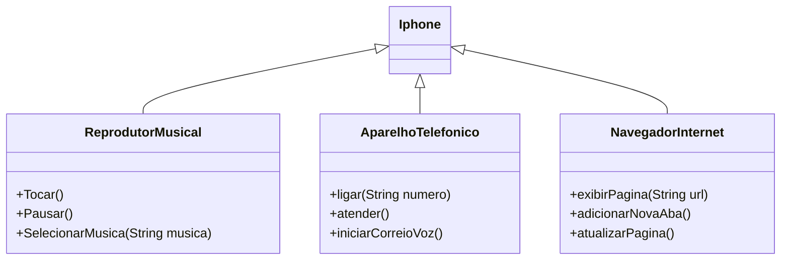

### Diagrama UML

```mermaid
classDiagram
    Iphone <|-- ReprodutorMusical
    Iphone <|-- AparelhoTelefonico
    Iphone <|-- NavegadorInternet
    class ReprodutorMusical{
      +Tocar()
      +Pausar()
      +SelecionarMusica(String musica)
    }
    class AparelhoTelefonico{
      +ligar(String numero)
      +atender()
      +iniciarCorreioVoz()
    }
    class NavegadorInternet{
      +exibirPagina(String url)
      +adicionarNovaAba()
      +atualizarPagina()
    }
```